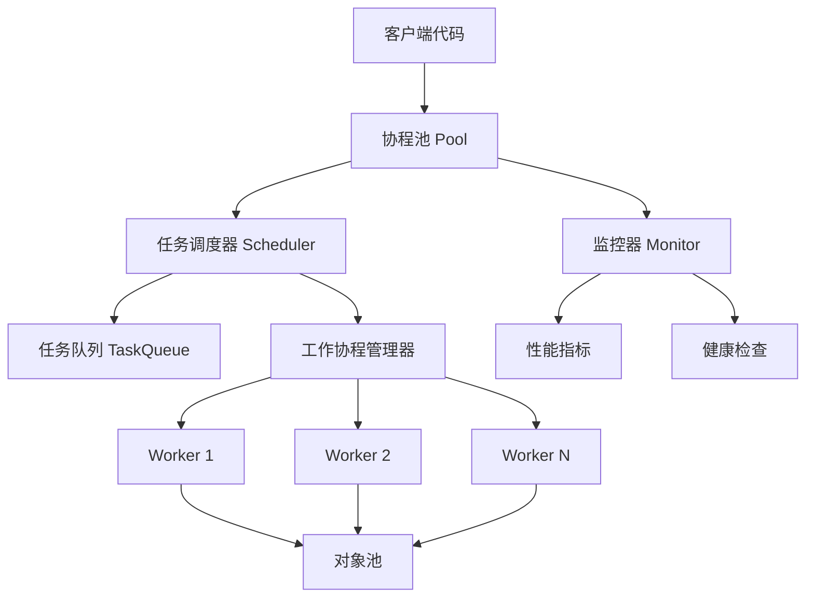

# 设计文档

## 概述

本设计文档描述了一个高性能Go协程池SDK的架构设计。该SDK采用生产者-消费者模式，结合对象池和无锁队列技术，实现高并发场景下的协程管理和任务调度。设计重点关注性能优化、内存管理和系统可靠性。

## 架构

### 核心架构图



### 分层架构

1. **API层**: 提供用户友好的接口
2. **调度层**: 负责任务分发和负载均衡
3. **执行层**: 工作协程执行具体任务
4. **资源层**: 对象池和内存管理
5. **监控层**: 性能监控和健康检查

## 组件和接口

### 1. 核心接口定义

```go
// Pool 协程池主接口
type Pool interface {
    // Submit 提交任务到协程池
    Submit(task Task) error
    // SubmitWithTimeout 带超时的任务提交
    SubmitWithTimeout(task Task, timeout time.Duration) error
    // SubmitAsync 异步提交任务，返回Future
    SubmitAsync(task Task) Future
    // Shutdown 优雅关闭协程池
    Shutdown(ctx context.Context) error
    // Stats 获取协程池统计信息
    Stats() PoolStats
}

// Task 任务接口
type Task interface {
    Execute(ctx context.Context) (interface{}, error)
    Priority() int // 任务优先级
}

// Future 异步结果接口
type Future interface {
    Get() (interface{}, error)
    GetWithTimeout(timeout time.Duration) (interface{}, error)
    IsDone() bool
    Cancel() bool
}
```

### 2. 配置结构

```go
// Config 协程池配置
type Config struct {
    // 核心配置
    WorkerCount    int           // 工作协程数量
    QueueSize      int           // 任务队列大小
    
    // 性能配置
    ObjectPoolSize int           // 对象池大小
    PreAlloc       bool          // 是否预分配内存
    
    // 超时配置
    TaskTimeout    time.Duration // 任务执行超时
    ShutdownTimeout time.Duration // 关闭超时
    
    // 监控配置
    EnableMetrics  bool          // 是否启用监控
    MetricsInterval time.Duration // 监控间隔
    
    // 扩展配置
    PanicHandler   func(interface{}) // panic处理器
    TaskInterceptor TaskInterceptor  // 任务拦截器
}
```

### 3. 协程池实现

```go
// pool 协程池实现
type pool struct {
    config       *Config
    workers      []*worker
    taskQueue    *lockFreeQueue
    scheduler    *scheduler
    monitor      *monitor
    objectPool   *sync.Pool
    
    // 状态管理
    state        int32  // 使用atomic操作
    wg           sync.WaitGroup
    ctx          context.Context
    cancel       context.CancelFunc
    
    // 统计信息
    stats        *poolStats
}
```

### 4. 工作协程设计

```go
// worker 工作协程
type worker struct {
    id           int
    pool         *pool
    taskChan     chan *taskWrapper
    lastActive   time.Time
    
    // 性能优化
    localQueue   []*taskWrapper // 本地任务队列
    objectCache  interface{}    // 本地对象缓存
}

// taskWrapper 任务包装器
type taskWrapper struct {
    task      Task
    future    *future
    submitTime time.Time
    priority   int
    
    // 对象池复用
    next      *taskWrapper // 链表指针
}
```

## 数据模型

### 1. 任务队列模型

采用无锁环形队列实现高性能任务分发：

```go
// lockFreeQueue 无锁队列
type lockFreeQueue struct {
    buffer    []*taskWrapper
    mask      uint64
    head      uint64  // 使用atomic操作
    tail      uint64  // 使用atomic操作
    capacity  uint64
}
```

### 2. 负载均衡模型

```go
// LoadBalancer 负载均衡器
type LoadBalancer interface {
    SelectWorker(workers []*worker) *worker
}

// RoundRobinBalancer 轮询负载均衡
type RoundRobinBalancer struct {
    counter uint64
}

// LeastLoadBalancer 最少负载均衡
type LeastLoadBalancer struct {
    // 基于工作协程的任务数量选择
}
```

### 3. 对象池模型

```go
// ObjectPool 对象池管理
type ObjectPool struct {
    taskPool    *sync.Pool  // 任务包装器池
    futurePool  *sync.Pool  // Future对象池
    contextPool *sync.Pool  // Context对象池
}
```

## 错误处理

### 1. 异常分类

- **任务执行异常**: 捕获panic，记录日志，恢复协程
- **队列满异常**: 提供阻塞/非阻塞选项
- **超时异常**: 任务执行超时自动取消
- **关闭异常**: 优雅关闭处理

### 2. 错误处理策略

```go
// ErrorHandler 错误处理接口
type ErrorHandler interface {
    HandlePanic(workerID int, task Task, panicValue interface{})
    HandleTimeout(task Task, duration time.Duration)
    HandleQueueFull(task Task) error
}

// 默认错误处理实现
type defaultErrorHandler struct {
    logger Logger
}
```

### 3. 熔断机制

```go
// CircuitBreaker 熔断器
type CircuitBreaker struct {
    failureThreshold int
    resetTimeout     time.Duration
    state           int32
    failures        int32
    lastFailTime    time.Time
}
```

## 测试策略

### 1. 单元测试

- **组件测试**: 每个核心组件的独立测试
- **接口测试**: 所有公开接口的功能测试
- **边界测试**: 极限情况和边界条件测试

### 2. 性能测试

- **基准测试**: 使用Go benchmark测试性能
- **压力测试**: 高并发场景下的稳定性测试
- **内存测试**: 内存泄漏和GC压力测试

### 3. 集成测试

- **并发测试**: 多协程并发提交任务测试
- **长时间运行测试**: 24小时稳定性测试
- **故障注入测试**: 模拟各种异常情况

### 4. 测试工具

```go
// TestHelper 测试辅助工具
type TestHelper struct {
    pool     Pool
    metrics  *TestMetrics
    tasks    []Task
}

// BenchmarkSuite 性能测试套件
type BenchmarkSuite struct {
    scenarios []BenchmarkScenario
}
```

## 性能优化策略

### 1. 内存优化

- **对象池**: 复用taskWrapper、Future等对象
- **预分配**: 启动时预分配内存块
- **零拷贝**: 最小化数据拷贝操作

### 2. 并发优化

- **无锁队列**: 减少锁竞争
- **本地队列**: 工作协程本地任务缓存
- **批量处理**: 批量获取和处理任务

### 3. 调度优化

- **工作窃取**: 空闲协程从忙碌协程窃取任务
- **优先级队列**: 支持任务优先级调度
- **动态调整**: 根据负载动态调整策略

## 监控和指标

### 1. 核心指标

```go
// PoolStats 协程池统计信息
type PoolStats struct {
    // 基础指标
    ActiveWorkers   int64   // 活跃工作协程数
    QueuedTasks     int64   // 排队任务数
    CompletedTasks  int64   // 已完成任务数
    FailedTasks     int64   // 失败任务数
    
    // 性能指标
    AvgTaskDuration time.Duration // 平均任务执行时间
    ThroughputTPS   float64       // 每秒处理任务数
    
    // 资源指标
    MemoryUsage     int64   // 内存使用量
    GCCount         int64   // GC次数
}
```

### 2. 监控接口

```go
// Monitor 监控接口
type Monitor interface {
    RecordTaskSubmit(task Task)
    RecordTaskComplete(task Task, duration time.Duration)
    RecordTaskFail(task Task, err error)
    GetStats() PoolStats
}
```

## 扩展机制

### 1. 中间件支持

```go
// Middleware 中间件接口
type Middleware interface {
    Before(ctx context.Context, task Task) context.Context
    After(ctx context.Context, task Task, result interface{}, err error)
}
```

### 2. 插件系统

```go
// Plugin 插件接口
type Plugin interface {
    Name() string
    Init(pool Pool) error
    Start() error
    Stop() error
}
```

### 3. 事件系统

```go
// EventListener 事件监听器
type EventListener interface {
    OnPoolStart(pool Pool)
    OnPoolShutdown(pool Pool)
    OnTaskSubmit(task Task)
    OnTaskComplete(task Task, result interface{})
    OnWorkerPanic(workerID int, panicValue interface{})
}
```